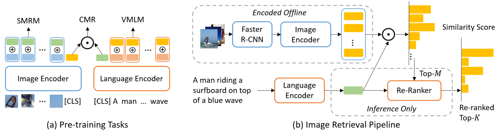

# LightningDOT: Pre-training Visual-Semantic Embeddings for Real-Time Image-Text Retrieval
This repository contains source code and pre-trained/fine-tuned checkpoints for NAACL 2021 paper ["LightningDOT"](https://arxiv.org/abs/2103.08784). It currently supports fine-tuning on MSCOCO and Flickr30k. Pre-training code and a demo for **FULL** MSCOCO retrieval are also available.



Some code in this repo is copied/modifed from [UNITER](https://github.com/ChenRocks/UNITER) and [DPR](https://github.com/facebookresearch/DPR).

If you find the code useful for your research, please consider citing:
```bibtex
    @inproceedings{sun2021lightningdot,
    title={LightningDOT: Pre-training Visual-Semantic Embeddings for Real-Time Image-Text Retrieval},
    author={Sun, Siqi and Chen, Yen-Chun and Li, Linjie and Wang, Shuohang and Fang, Yuwei and Liu, Jingjing},
    booktitle={NAACL-HLT},
    year={2021}
    } 
```


### UNITER Environment
To run UNITER for re-ranking, please set a seperate environment based on [this repo](https://github.com/ChenRocks/UNITER). 

The rest of code is using a conda environment that can be created as follows.
## Environment

Under the project home folder, first run (depends on **your CUDA version**)
```bash
conda env create -f DVL.yml
conda activate DVL
conda install pytorch torchvision cudatoolkit=10.1 -c pytorch
```
, then install apex by 
```bash
cd ../
git clone https://github.com/NVIDIA/apex
cd apex
pip install -v --no-cache-dir --global-option="--cpp_ext" --global-option="--cuda_ext" ./
```
In order to use distributed training, under super user, install mpi by

```bash
rm -r /usr/local/mpi

wget https://download.open-mpi.org/release/open-mpi/v4.0/openmpi-4.0.4.tar.gz 
tar -xvf openmpi-4.0.4.tar.gz 
cd openmpi-4.0.4
./configure --prefix=/usr/local/mpi --enable-orterun-prefix-by-default --disable-getpwuid --with-verbs
sudo apt-get install libnuma-dev
sudo make -j$(nproc) all && sudo make install
ldconfig

cd -
rm -r openmpi-4.0.4
rm openmpi-4.0.4.tar.gz

export OPENMPI_VERSION=4.0.4
```
. Finally install horovod by 
```bash
echo "deb http://developer.download.nvidia.com/compute/machine-learning/repos/ubuntu1604/x86_64 /" \
    > /etc/apt/sources.list.d/nvidia-ml.list
apt update
apt install libnccl2=2.4.7-1+cuda10.1 libnccl-dev=2.4.7-1+cuda10.1

export PATH=/usr/local/mpi/bin:$PATH
HOROVOD_GPU_ALLREDUCE=NCCL HOROVOD_WITH_PYTORCH=1 pip install --no-cache-dir horovod
ldconfig
```

If you see Error Msg:
/usr/bin/ld: cannot find -lnuma, then try
```bash
sudo apt-get install libnuma-dev
```

## Download Checkpoints and Meta file
Under project home folder, run
```bash
bash bash/download_data.sh
```
Currently the raw image files and extracted features are not available to download.

## Pre-training
Modify the config file at ./config/pretrain-alldata-base.json accordingly, and run
```bash
horovodrun -np $NUM_GPU python pretrain.py --config ./config/pretrain-alldata-base.json
```
. Typically you need to change img_checkpoint, output_dir, and train/val datasets.

A pre-trained checkpoint is availabe at [LightningDot](https://convaisharables.blob.core.windows.net/lightningdot/LightningDot.pt).

The checkpoints for UNITER-base and BERT-base can be obtaind from [UNITER-base](https://convaisharables.blob.core.windows.net/lightningdot/uniter-base.pt) and [BERT-base](https://convaisharables.blob.core.windows.net/lightningdot/bert-base-cased.pt).


## Fine-tuning on MSCOCO and Flickr30k
We provide a sample bash script at **./bash/train_flickr.sh**, which we used to search for learning rate.

Two checkpoints (fine-tuned on MSCOCO and Flickr30k) are also provided at [COCO-FT](https://convaisharables.blob.core.windows.net/lightningdot/coco-ft.pt) and [Flickr-FT](https://convaisharables.blob.core.windows.net/lightningdot/flickr-ft.pt).


## Evaluation
Run
```bash
python eval_itm.py  your_eval_config.json  your_checkpoint.pt 
```
to run the evaluation script.
We provide three examples that could be obtained solely based on checkpoints and configurations in this repo.

Note that your results may NOT be exactly the same with results below due to different machine/environment configurations (but they should be close enough).


- Zero-shot evaluation on Flickr30k:
```bash
python eval_itm.py ./config/flickr30k_eval_config.json ./data/model/LightningDot.pt
```
```
image retrieval recall = {1: 0.5332, 5: 0.8058, 10: 0.8804}
txt retrieval recall = {1: 0.682, 5: 0.891, 10: 0.94}.
```

- Fine-tune on flickr, evaluate on flickr:
```bash
python eval_itm.py ./config/flickr30k_eval_config.json ./data/model/flickr-ft.pt
```
```
image retrieval recall = {1: 0.699, 5: 0.911, 10: 0.9518}
txt retrieval recall = {1: 0.839, 5: 0.972, 10: 0.986}
```
- Fine-tune on MSCOCO, evaluate on MSCOCO:
```bash
python eval_itm.py ./config/coco_eval_config.json ./data/model/coco-ft.pt
```
```
image retrieval recall = {1: 0.4577, 5: 0.7453, 10: 0.8379}
txt retrieval recall = {1: 0.6004, 5: 0.8516, 10: 0.9172}
```


## Meta File
You may need the meta file used in some scripts, which can be obtained from [MSCOCO-Meta](https://convaisharables.blob.core.windows.net/lightningdot/coco-meta.pt) and [Flickr-Meta](https://convaisharables.blob.core.windows.net/lightningdot/flickr-meta.pt).

## Demo 
TODO


## Re-Ranking
Note that Re-ranker is using prediction file generated from UNITER or OSCAR due to use of different pytorch version. 

Re-ranking script is currently provided as is, and has not been cleaned yet. 


## Contributing
This project welcomes contributions and suggestions. Most contributions require you to agree to a Contributor License Agreement (CLA) declaring that you have the right to, and actually do, grant us the rights to use your contribution. For details, visit https://cla.opensource.microsoft.com.

When you submit a pull request, a CLA bot will automatically determine whether you need to provide a CLA and decorate the PR appropriately (e.g., status check, comment). Simply follow the instructions provided by the bot. You will only need to do this once across all repos using our CLA.

This project has adopted the Microsoft Open Source Code of Conduct. For more information see the Code of Conduct FAQ or contact opencode@microsoft.com with any additional questions or comments.

## License

MIT
